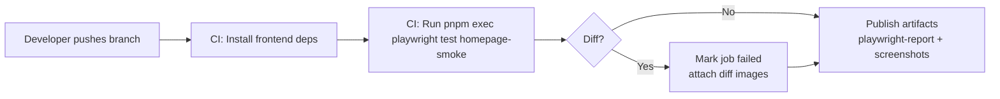

# SPEC-playwright-screenshot-poc

## Status

- Accepted

## Owners

- QA Lead (TBD)
- Frontend Maintainer (TBD)

## Date

- 2025-10-30

## Summary

Establish an initial Playwright UI test that captures and publishes deterministic screenshots so we can validate the artifact pipeline before broadening coverage.

## Context

- The broader Playwright regression suite is still in planning (see [SPEC-playwright-ui-regression](01-SPEC-playwright-ui-regression.md)).
- Product wants visual confidence when redesigning the booking wizard, but we must first ensure CI can record and surface screenshots and traces reliably.
- CI currently lacks screenshot artifact handling, making it risky to scale snapshot coverage without a proof-of-concept.

## Goals (Acceptance criteria)

- A single Playwright test (`frontend/tests/e2e/homepage-smoke.spec.ts`) loads the booking entry page and captures a full-page screenshot after the hero content renders.
- Running `pnpm exec playwright test homepage-smoke` locally or in CI produces a named screenshot artifact stored under `frontend/tests/e2e/__screenshots__/homepage-smoke-chromium.png`.
- CI pipeline uploads the screenshot and the associated Playwright HTML report as job artifacts that can be downloaded for review.
- Visual baseline is version-controlled, and test failure occurs when the screenshot diff exceeds Playwright's default threshold (0.2%).
- Screenshot captures stabilise the on-page current date (freeze or mask) so baseline churn comes only from intentional UI changes.
- Documentation in `README.md` (UI testing section) explains how to update the baseline and view artifacts.

## Non-goals

- Adding multiple screenshot tests or covering full booking flows.
- Introducing cross-browser visual baselines (Chromium only for this iteration).
- Implementing automatic Slack/email notifications on screenshot diffs.
- Recording videos or full Playwright traces (optional toggles only).

## Decision

- Use Playwright's built-in screenshot comparison assertions with `expect(page).toHaveScreenshot({ fullPage: true })` for simplicity and determinism.
- Store baseline assets inside `frontend/tests/e2e/__screenshots__/` to keep them close to the spec and enable review via standard code diffs.
- Extend the existing CI workflow (GitHub Actions) with steps that run the single test headless, then upload the `playwright-report` and screenshot diff folder as artifacts.

### Alternatives considered

- **Percy/Chromatic SaaS snapshots**: deferred due to new dependency, billing, and approval timelines.
- **Custom Puppeteer script**: rejected because Playwright already provides assertion and artifact tooling with minimal config.
- **Full-suite rollout first**: rejected; we need a controlled proof to ensure pipeline stability before scaling.

## Architecture and Design

- **Test placement**: create `frontend/tests/e2e/homepage-smoke.spec.ts` using Playwright test runner, tagging with `@screenshot` for future filtering.
- **Baseline storage**: check in `frontend/tests/e2e/__screenshots__/homepage-smoke-chromium.png` and ensure `.gitignore` permits `.png` baselines but ignores Playwright output directories (`test-results/`, `playwright-report/`).
- **Config updates**: adjust `playwright.config.ts` with `snapshotDir` pointing to `frontend/tests/e2e/__screenshots__` and set `expect: { toHaveScreenshot: { timeout: 15000 } }`.
- **CI workflow**: add a `frontend-playwright-screenshot` job invoking `pnpm install` + `pnpm exec playwright test homepage-smoke`; on completion, upload `playwright-report` and `test-results` via workflow artifacts.
- **Local developer workflow**: update docs to run `pnpm exec playwright test homepage-smoke --update-snapshots` after UI changes, and `pnpm exec playwright show-report` to review results.

## Performance and Complexity

- Expected runtime: <1 minute end-to-end in CI on default GitHub-hosted runners.
- Screenshot comparison operates on a single 1440x900 capture; memory footprint negligible.
- No additional load on backend beyond a single anonymous homepage visit.

## Compatibility and Platforms

- Chromium browser (Playwright bundled) on GitHub-hosted Ubuntu runners and macOS/Windows developer machines.
- Viewport: 1440x900 to match current design QA baseline.
- No feature flags required; test conditioned to run with existing Vite dev/prod build.

## Security, Privacy, and Compliance

- Screenshots contain only synthetic hero copy; ensure environment loads seed data without PII.
- Artifacts remain within CI and are subject to repository access controls; no external uploads.
- Document process for purging artifacts if secrets ever appear (manual review before merge).

## Test Plan

- Local developer run verifying baseline creation and detection of intentional style change.
- CI job validating that artifacts are present and downloadable on success/failure.
- Manual check of artifact diff folder to confirm Playwright stores expected `*-diff.png` when assertion fails.
- Smoke test verifying documentation instructions (`--update-snapshots`) refreshes baseline without leftover files.

## Rollout and Monitoring

- Phase 0: Land spec and align with Product/QA stakeholders.
- Phase 1: Implement single screenshot test and CI artifact steps; run on a feature branch to validate outputs.
- Phase 2: Merge to main once artifact access is confirmed; monitor first three runs for flakes.
- Rollback: disable the CI job or revert the Playwright config change if failures block pipelines.

## Risks and Mitigations

- **Flaky rendering due to async content**: Add explicit waits for hero selector and network idle before capturing screenshot.
- **Baseline churn from dynamic timestamps**: Freeze or mock the current date, and consult the PO before masking any additional dynamic content.
- **Artifact size growth**: Keep single baseline small; revisit compression strategy before scaling to more tests.

## Open Questions

- None.

## References

- [SPEC-playwright-ui-regression](01-SPEC-playwright-ui-regression.md)
- [Playwright Screenshot Testing Docs](https://playwright.dev/docs/test-snapshots)

## History

- 2025-10-30: Proposal drafted for screenshot proof-of-concept.
