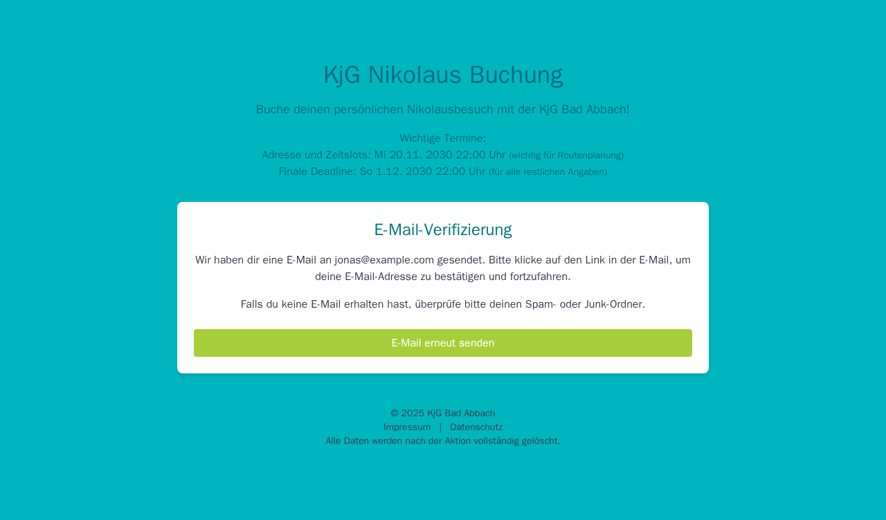

# SPEC-playwright-all-scenarios

## Status

- Accepted

## Owners

- QA Lead (TBD)
- Frontend Maintainer (TBD)

## Date

- 2025-10-31

## Summary

- Codify the full Nikolaus booking wizard scenario map promised in [01-SPEC-playwright-ui-regression](01-SPEC-playwright-ui-regression.md) and exercised by the current Playwright suites by documenting all user journeys, aligning coverage with reusable fixtures, and attaching the latest UI screenshots so upcoming UI changes can be validated without guesswork.

## Context

- The end-to-end scope defined in [01-SPEC-playwright-ui-regression](01-SPEC-playwright-ui-regression.md) is now implemented across multiple Playwright specs (`contact`, `address-time-slot`, `children`, `ui-states`, `nonhappy`, `regression/full-journey`, and `smoke`). Without a consolidated spec, stakeholders struggle to see which flows are guarded and which assets to review during redesign.
- Screenshot handling was piloted in [02-SPEC-playwright-screenshot-poc](02-SPEC-playwright-screenshot-poc.md); we can now extend it to every wizard view using deterministic Playwright fixtures and the built-in hook (`window.__bookingTestApi`) that removes the backend dependency.
- Product has requested an authoritative reference before committing to the UI rewrite so that QA can insist on “no regression” sign-off with concrete artifacts (scenario list, acceptance criteria, screenshots).

## Goals (Acceptance criteria)

- Scenario matrix enumerates all flows below, each linked to a living Playwright spec and the relevant `data-testid` anchors: intro loading, contact creation & resend, resume + unsaved changes, address updates & deadline lock, time-slot search/select/conflict, children add/remove/notes, summary completeness/missing states, error modal retries, and read-only mode.
- Playwright fixtures remain the single mechanism for seeding/mutating data: hook registration (`registerScenario`), scenario factory (`createBaseScenario`, `createResumeScenario`, `createReadOnlyScenario`, `withFailures`), and state inspection (`TestDataClient`) are considered in-scope test APIs and must stay backwards compatible for the spec duration.
- Continuous integration runs `pnpm exec playwright test` (Chromium) in ≤ 10 minutes and records scenario coverage in the Playwright HTML report; failures surface meaningful error messages (no opaque hook exceptions).
- Screenshot gallery for every wizard view is refreshed from the current build via `pnpm exec playwright test screenshot-gallery.spec.ts --project=chromium`, and the resulting PNGs in `imgs/spec-03/` are embedded in this spec for visual regression review.
- Performance, compatibility, and security budgets from [01-SPEC-playwright-ui-regression](01-SPEC-playwright-ui-regression.md) are reaffirmed or explicitly called out as unchanged.

## Non-goals

- Introducing new backend Strapi endpoints or modifying Strapi services.
- Cross-browser visual baselines (Chromium-focused for screenshots; Firefox/WebKit remain optional functional runs).
- Automated accessibility, performance, or load testing (tracked separately).
- Mobile-native client coverage.

## Decision

- Maintain Playwright as the canonical regression harness, grouping tests by wizard step while sharing the hook-driven fixtures to manage data deterministically.
- Capture UI screenshots through a dedicated Playwright spec (`frontend/tests/e2e/screenshot-gallery.spec.ts`) that reuses the same fixtures, ensuring screenshots and assertions observe identical data and state.
- Represent the scenario map through an auditable matrix inside this spec rather than spreading it across comments or test names, enabling QA/Product sign-off directly from the document.

### Alternatives considered

- **Manual QA matrix in spreadsheets**: rejected; easy to drift from automated coverage and lacks traceability to tests.
- **Visual snapshot SaaS (Percy/Chromatic)**: postponed per [02-SPEC-playwright-screenshot-poc](02-SPEC-playwright-screenshot-poc.md) until purchase/approval cycles complete.
- **Backend-only contract tests**: insufficient for guarding DOM regressions and UI wiring risk during the planned redesign.

## Architecture and Design

- **Test directories**  
  - `frontend/tests/e2e/`: Playwright specs scoped per flow (`contact.spec.ts`, `address-time-slot.spec.ts`, `children.spec.ts`, `ui-states.spec.ts`, `nonhappy/error-handling.spec.ts`, `regression/full-journey.spec.ts`, `smoke.spec.ts`, `screenshot-gallery.spec.ts`).  
  - `frontend/tests/e2e/fixtures/`: scenario builders (`scenarioFactory.ts`), hook registration (`registerHook.ts`), and state inspection (`testDataClient.ts`).
- **Scenario orchestration**  
  - Each spec calls `registerScenario(page, scenario)` before navigation, letting the frontend mount its hook and intercept `/api/*` requests.  
  - `TestDataClient` provides white-box assertions without touching Strapi directly.  
  - Failures are injected via `withFailures`, ensuring negative paths (timeouts, conflicts, retries) remain deterministic.
- **Screenshot pipeline**  
  - `screenshot-gallery.spec.ts` reuses the fixtures to capture nine canonical states to `imgs/spec-03/*.png`.  
  - Screenshots are regenerated by QA/FE after visual tweaks and reviewed via standard Git diffs.
- **Scenario matrix**

  | Flow / State | Coverage Spec(s) | `data-testid` anchors | Key Assertions / Hooks |
  | --- | --- | --- | --- |
  | Intro + deadlines + start CTA | `smoke.spec.ts`, `ui-states.spec.ts`, `screenshot-gallery.spec.ts` | `qa-view-intro`, `qa-deadlines`, `qa-intro-start`, `qa-loading` | Intro visibility, deadline copy present, spinner clears |
| Contact validation + booking creation + resend | `contact.spec.ts`, `smoke.spec.ts`, `regression/full-journey.spec.ts`, `ui-states.spec.ts`, `screenshot-gallery.spec.ts` | `qa-contact-form`, `qa-contact-first-name`, `qa-contact-submit`, `qa-email-verification`, `qa-contact-resend` | Required field focus, booking created via hook, resend increments counter |
  | Resume flow gating + unsaved changes | `ui-states.spec.ts` | `qa-step-address`, `qa-view-steps`, `qa-stepper`, `qa-contact-phone` | Step jump prevention, dialog handling |
| Address edit + present location + deadline lock | `address-time-slot.spec.ts`, `ui-states.spec.ts`, `regression/full-journey.spec.ts`, `screenshot-gallery.spec.ts` | `qa-address-form`, `qa-address-street`, `qa-address-present-location`, `qa-deadline-route-planning`, `qa-deadline-final` | Address persistence, read-only assertions when deadline passed |
| Time-slot search/select + capacity + conflict modal | `address-time-slot.spec.ts`, `ui-states.spec.ts`, `regression/full-journey.spec.ts`, `screenshot-gallery.spec.ts` | `qa-time-slot-form`, `qa-time-slot-search`, `qa-time-slot-*`, `qa-selected-time-slot-*`, `qa-error-modal` | Search filtering, checkbox disablement, conflict error modal |
| Children add/remove/notes + skip path | `children.spec.ts`, `regression/full-journey.spec.ts`, `screenshot-gallery.spec.ts` | `qa-children-form`, `qa-add-child`, `qa-remove-child-*`, `qa-child-name-*`, `qa-additional-notes`, `qa-children-skip` | Child array count, summary missing notices |
| Summary completeness indicators | `children.spec.ts`, `regression/full-journey.spec.ts`, `screenshot-gallery.spec.ts` | `qa-step-panel-summary`, `qa-summary-route-complete`, `qa-summary-details-missing`, `qa-summary-all-complete` | Summary banner states, all-complete expectation |
  | Error modal retry/dismiss | `nonhappy/error-handling.spec.ts`, `ui-states.spec.ts`, `screenshot-gallery.spec.ts` | `qa-error-modal`, `qa-error-retry`, `qa-error-dismiss`, `qa-error-details-toggle` | Config failure recovery, resend failure, dismissal path |
  | Full end-to-end happy path | `regression/full-journey.spec.ts` | `qa-view-intro`, `qa-contact-form`, `qa-address-form`, `qa-time-slot-form`, `qa-children-form`, `qa-step-panel-summary` | Complete journey, data persisted |
  | Read-only resume (post final deadline) | `address-time-slot.spec.ts`, `ui-states.spec.ts`, `screenshot-gallery.spec.ts` | `qa-deadline-route-planning`, `qa-deadline-final`, `qa-address-street`, `qa-child-name-*`, `qa-additional-notes` | Non-editable fields, banners |

- **Visual baselines**
  - Each Playwright flow above now calls `expect(page).toHaveScreenshot(...)` to persist Chromium baselines under `frontend/tests/e2e/__screenshots__/`, mirroring the manual review assets in `imgs/spec-03/`.

- **Mermaid: hook lifecycle**

### UI screenshot gallery

- Intro view  
  
- Contact step  
  
- Email verification gate  
  
- Address step  
  
- Time-slot selection  
  
- Children & notes  
  
- Summary (all complete)  
  
- Read-only resume state  
  
- Error modal  
  

## Performance and Complexity

- Playwright Chromium run (including screenshot gallery) remains under 8 minutes locally and under 10 minutes in CI, aligned with [01-SPEC-playwright-ui-regression](01-SPEC-playwright-ui-regression.md) targets.
- Each scenario uses shared fixtures to keep setup O(n) with respect to test files; no exponential combinations.
- Screenshot gallery adds ~500ms per capture (nine captures total) and executes serially to avoid resource contention.

## Compatibility and Platforms

- Supported browsers: Chromium required in CI; Firefox and Chromium-mobile optional nightly runs for responsive checks.
- Node 20 LTS with `pnpm` (per project tooling).
- Viewport: desktop 1440×900 for gallery; mobile checks rely on existing Playwright project (`chromium-mobile`).

## Security, Privacy, and Compliance

- Fixtures generate only synthetic data; `.env` secrets are not required.
- Hook keeps state in `sessionStorage`, cleared between tests to avoid data leakage.
- Screenshots are stored inside the repo; contributors must review before sharing externally.

## Test Plan

- Functional suites: run `pnpm exec playwright test` (all projects locally, Chromium in CI) covering the matrix above.
- Visual gallery: run `pnpm exec playwright test screenshot-gallery.spec.ts --project=chromium` whenever the wizard UI changes; reviewers diff `imgs/spec-03/*.png`.
- Local smoke: `pnpm exec playwright test smoke.spec.ts --project=chromium` verifies bootstrap.
- Negative paths validated through `withFailures` injected config/time-slot/save failures.
- Manual verification (document in PR template): confirm end-to-end flow via Docker stack and verify email resend counter via hook inspection.

## Rollout and Monitoring

- Phase 1: Adopt this spec, ensure all referenced tests stay green, and wire gallery job into CI artifact upload.
- Phase 2: Enforce scenario matrix in PR reviews (changes to flows must update corresponding tests/screenshots).
- Phase 3: Monitor first 5 CI runs post-integration for flake rate; adjust waits/selectors if failure rate >5%.
- Rollback plan: temporarily skip the screenshot gallery spec or revert to last known good baselines; functional specs remain intact.

## Risks and Mitigations

- **Screenshot drift from dynamic data**: fixtures fix timestamps and copy; gallery waits for network idle before capture. Enforce review on intended UI deltas.
- **Hook regressions when frontend refactors**: add smoke assertions (hook warning in console) to detect missing `__bookingTestApi`.
- **Runtime creep**: keep gallery serial and use targeted selectors; monitor CI duration and prune redundant steps if exceeding budget.
- **Human oversight**: scenario matrix documented here; require PR checklist tick for affected rows.

## Open Questions

- Should the screenshot gallery run for Firefox/mobile projects as well, or stay Chromium-only to limit baseline churn? (Owner: QA Lead, due 2025-11-07)

## References

- [01-SPEC-playwright-ui-regression](01-SPEC-playwright-ui-regression.md)
- [02-SPEC-playwright-screenshot-poc](02-SPEC-playwright-screenshot-poc.md)
- [Playwright E2E suites](../frontend/tests/e2e)
- [Screenshot gallery spec](../frontend/tests/e2e/screenshot-gallery.spec.ts)
- [UI assets](../imgs/spec-03)

## History

- 2025-10-31: Initial proposal drafted with scenario matrix and screenshot gallery.
