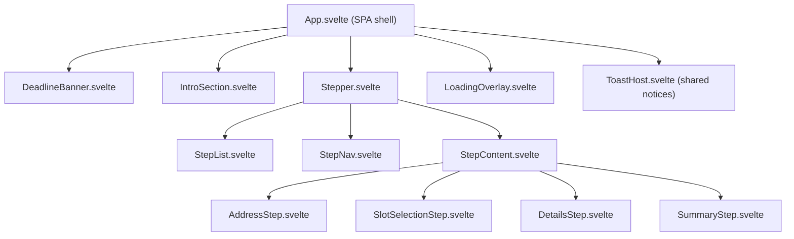

# SPEC-svelte-migration

## Status

- Accepted

## Owners

- TBD (Frontend Team)

## Date

- 2025-10-31

## Summary

Migrate the existing Alpine.js- and Tailwind-based booking single-page application to a modular Svelte SPA while preserving identical functionality, visuals, and automated test coverage. The migration will introduce a reusable component hierarchy, Svelte store-backed state management, and a modern Vite-based build setup without altering the user experience or backend contracts.

## Context

- The current frontend relies on Alpine.js embedded in a single HTML file, which makes reuse, testing, and long-term maintenance difficult as the booking flow grows in complexity.
- Stakeholders expect no user-facing changes—visual or behavioral—during the migration; the Strapi backend and existing APIs must remain untouched.
- Existing Playwright regression specs ([01-SPEC-playwright-ui-regression](01-SPEC-playwright-ui-regression.md)) enforce the current UX and should remain authoritative.

## Goals (Acceptance criteria)

- A Svelte SPA replaces the Alpine.js implementation while rendering an indistinguishable UI and behavior compared with the current production build.
- The generated HTML structure (element hierarchy, semantic tags, `data-testid`s) and Tailwind class names remain byte-for-byte identical so existing screenshot and visual regression tests stay green.
- The booking flow is decomposed into reusable Svelte components (e.g., intro content, stepper, per-step forms, deadline banners, loading indicators).
- Global state (step navigation, deadlines, form data, loading flags) is managed via Svelte stores with persistence rules mirroring the current logic.
- Existing E2E tests continue to run with only compatibility adjustments (e.g., selector updates); no test assertions are relaxed or removed.
- Tailwind styling, environment configuration, and API integrations (tokens, base URLs) continue to work without manual page reloads.

## Non-goals

- Introducing new user-facing features, copy changes, or visual redesigns.
- Modifying Strapi APIs, database schema, or backend configuration.
- Replacing the existing Tailwind design system or build pipeline outside the frontend SPA.

## Decision

- Adopt a Vite + Svelte project inside `frontend/`, leveraging Svelte's component model and built-in store utilities for state while keeping Tailwind for styling.
- Mirror the current Alpine data model through dedicated Svelte stores to centralize logic (e.g., `bookingStore`, `optionsStore`) and expose derived values (`canEditRoutePlanning`, `currentStep`).
- Use a single Svelte router entry (e.g., `App.svelte`) to preserve SPA behavior, with top-level layout components orchestrating subcomponents.

### Alternatives Considered

- **SvelteKit full migration**: Rejected for now to avoid introducing routing and server-side rendering complexity when only a single SPA route is required.
- **Incremental Alpine-to-Svelte island integration**: Rejected because it would keep two paradigms in the codebase and slow the full migration while not delivering the desired modular architecture.
- **React/Vue rewrite**: Out of scope given the explicit Svelte requirement and existing team familiarity with Svelte.

## Architecture and Design

- **Project layout**: Introduce `frontend/src/app/` for Svelte files with `App.svelte` as the SPA root, `lib/components/` for reusable UI modules, and `lib/stores/` for shared state.
- **Component hierarchy**:

- **State management**: Svelte writable stores encapsulate global booking state, deadlines, and async status. Derived stores expose computed flags (e.g., `canEditRoutePlanning`, `isSubmitting`). Store hydrating actions will load initial data from the API and expose methods (`setStep`, `updateField`, `refreshDeadlines`).
- **Data fetching**: Extract existing `fetch` logic into `lib/api/bookingClient.ts` (TypeScript) with typed DTOs mirroring Strapi responses. Use `onMount` within `App.svelte` to initialize stores.
- **Styling**: Reuse Tailwind configuration; integrate with Svelte via `@sveltejs/vite-plugin-svelte` and Tailwind PostCSS pipeline. Preserve all existing class names to guarantee identical rendering.
- **Templating**: Replace Blade-like `mix()` helpers with Vite asset handling, ensuring environment variables flow through Vite (`VITE_API_BASE_URL`, `VITE_API_TOKEN`) and are surfaced on `window` only if required by tests.

## Performance and Complexity

- Maintain current load performance: initial bundle should remain under 300 KB gzipped (parity with existing build; verify via Vite report).
- State updates and UI rendering must stay O(1) per event, with derived computations limited to the active step.
- No additional performance budgets beyond parity are introduced; monitoring for regressions via Lighthouse is recommended.

## Compatibility and Platforms

- Browsers: Latest Chrome, Firefox, Edge, and Safari ≥16 (matching current support). Ensure graceful behavior on iOS Safari.
- SPA remains rooted at `/` with client-side navigation only; deep links are not introduced.
- Environment variables remain configured through `.env` → `pnpm dev/build`; Docker workflows updated to use new build commands.

## Security, Privacy, and Compliance

- Preserve existing token handling: no secrets embedded in bundles; rely on environment variables injected at build time.
- Ensure form validation parity to prevent new data quality issues.
- Audit new dependencies for license compatibility (MIT/Apache preferred).

## Test Plan

- Run existing Playwright regression and scenario suites unchanged; adjust selectors only when structural shifts necessitate it.
- Add Svelte component-level unit tests (via `@testing-library/svelte`) for core interactions (step transitions, API fetch fallback) while keeping total coverage consistent.
- Smoke-test API integrations against Strapi staging; validate Mailhog notification flows manually.
- Capture before/after visual snapshots to confirm pixel parity.

## Rollout and Monitoring

- Implement behind a feature branch with a Vite preview deployed to staging for stakeholder sign-off.
- Update Docker build scripts to use `pnpm build` -> `vite build`, ensuring containerized delivery continues to serve the SPA.
- Monitor error logs, API latency, and booking completion metrics during the first release window; prepare rollback by retaining the Alpine build artifact.

## Risks and Mitigations

- **Hidden behavioral differences**: Mitigate by running full Playwright suites and diffing API payloads between old and new implementations.
- **Bundle size regression**: Track via Vite analyzer; refactor shared modules or enable code-splitting if needed.
- **Developer learning curve**: Provide internal walkthroughs/documentation on Svelte patterns before implementation begins.

## Open Questions

- Confirm whether we should expose any new analytics hooks during the migration (owner: Product, due 2025-11-07).
- Clarify if server-rendered HTML fallback is required for SEO or if SPA-only delivery is acceptable long-term (owner: Product, due 2025-11-07).
- Validate whether the existing `mix()` asset helper is still needed for legacy integrations or can be removed entirely (owner: DevOps, due 2025-11-05).

## References

- [01-SPEC-playwright-ui-regression](01-SPEC-playwright-ui-regression.md)
- [03-SPEC-playwright-all-scenarios](03-SPEC-playwright-all-scenarios.md)
- [Tailwind Configuration](../frontend/tailwind.config.js)

## History

- 2025-10-31: Initial proposal drafted.
