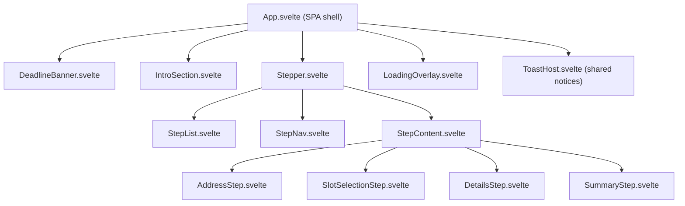

# SPEC-svelte-migration

## Status

- Accepted

## Owners

- TBD (Frontend Team)

## Date

- 2025-10-31

## Summary

Migrate the existing Alpine.js- and Tailwind-based booking single-page application to a modular Svelte SPA while preserving identical functionality, visuals, and automated test coverage. The migration will introduce a reusable component hierarchy, Svelte store-backed state management, and a modern Vite-based build setup without altering the user experience or backend contracts.

## Context

- The current frontend relies on Alpine.js embedded in a single HTML file, which makes reuse, testing, and long-term maintenance difficult as the booking flow grows in complexity.
- Stakeholders expect no user-facing changes—visual or behavioral—during the migration; the Strapi backend and existing APIs must remain untouched.
- Existing Playwright regression specs ([01-SPEC-playwright-ui-regression](01-SPEC-playwright-ui-regression.md)) enforce the current UX and should remain authoritative.

## Goals (Acceptance criteria)

- A Svelte SPA replaces the Alpine.js implementation while rendering an indistinguishable UI and behavior compared with the current production build.
- The generated HTML structure (element hierarchy, semantic tags, `data-testid`s) and Tailwind class names remain byte-for-byte identical so existing screenshot and visual regression tests stay green.
- The booking flow is decomposed into reusable Svelte components (e.g., intro content, stepper, per-step forms, deadline banners, loading indicators).
- Global state (step navigation, deadlines, form data, loading flags) is managed via Svelte stores with persistence rules mirroring the current logic.
- Existing E2E tests continue to run with only compatibility adjustments (e.g., selector updates); no test assertions are relaxed or removed.
- Tailwind styling, environment configuration, and API integrations (tokens, base URLs) continue to work without manual page reloads.

## Non-goals

- Introducing new user-facing features, copy changes, or visual redesigns.
- Modifying Strapi APIs, database schema, or backend configuration.
- Replacing the existing Tailwind design system or build pipeline outside the frontend SPA.

## Decision

- Adopt a Vite + Svelte project inside `frontend/`, leveraging Svelte's component model and built-in store utilities for state while keeping Tailwind for styling.
- Mirror the current Alpine data model through dedicated Svelte stores to centralize logic (e.g., `bookingStore`, `optionsStore`) and expose derived values (`canEditRoutePlanning`, `currentStep`).
- Use a single Svelte router entry (e.g., `App.svelte`) to preserve SPA behavior, with top-level layout components orchestrating subcomponents.

### Alternatives Considered

- **SvelteKit full migration**: Rejected for now to avoid introducing routing and server-side rendering complexity when only a single SPA route is required.
- **Incremental Alpine-to-Svelte island integration**: Rejected because it would keep two paradigms in the codebase and slow the full migration while not delivering the desired modular architecture.
- **React/Vue rewrite**: Out of scope given the explicit Svelte requirement and existing team familiarity with Svelte.

## Architecture and Design

- **Project layout**: Introduce `frontend/src/app/` for Svelte files with `App.svelte` as the SPA root, `lib/components/` for reusable UI modules, and `lib/stores/` for shared state.
- **Component hierarchy**:



- **State management**: Svelte writable stores encapsulate global booking state, deadlines, and async status. Derived stores expose computed flags (e.g., `canEditRoutePlanning`, `isSubmitting`). Store hydrating actions will load initial data from the API and expose methods (`setStep`, `updateField`, `refreshDeadlines`).
- **Data fetching**: Extract existing `fetch` logic into `lib/api/bookingClient.ts` (TypeScript) with typed DTOs mirroring Strapi responses. Use `onMount` within `App.svelte` to initialize stores.
- **Styling**: Reuse Tailwind configuration; integrate with Svelte via `@sveltejs/vite-plugin-svelte` and Tailwind PostCSS pipeline. Preserve all existing class names to guarantee identical rendering.
- **Templating**: Replace Blade-like `mix()` helpers with Vite asset handling, ensuring environment variables flow through Vite (`VITE_API_BASE_URL`, `VITE_API_TOKEN`) and are surfaced on `window` only if required by tests.

## Performance and Complexity

- Maintain current load performance: initial bundle should remain under 300 KB gzipped (parity with existing build; verify via Vite report).
- State updates and UI rendering must stay O(1) per event, with derived computations limited to the active step.
- No additional performance budgets beyond parity are introduced; monitoring for regressions via Lighthouse is recommended.

## Compatibility and Platforms

- Browsers: Latest Chrome, Firefox, Edge, and Safari ≥16 (matching current support). Ensure graceful behavior on iOS Safari.
- SPA remains rooted at `/` with client-side navigation only; deep links are not introduced.
- Environment variables remain configured through `.env` → `pnpm dev/build`; Docker workflows updated to use new build commands.

## Security, Privacy, and Compliance

- Preserve existing token handling: no secrets embedded in bundles; rely on environment variables injected at build time.
- Ensure form validation parity to prevent new data quality issues.
- Audit new dependencies for license compatibility (MIT/Apache preferred).

## Test Plan

- Run existing Playwright regression and scenario suites unchanged; adjust selectors only when structural shifts necessitate it.
- Add Svelte component-level unit tests (via `@testing-library/svelte`) for core interactions (step transitions, API fetch fallback) while keeping total coverage consistent.
- Smoke-test API integrations against Strapi staging; validate Mailhog notification flows manually.
- Capture before/after visual snapshots to confirm pixel parity.

## Rollout and Monitoring

- Implement behind a feature branch with a Vite preview deployed to staging for stakeholder sign-off.
- Update Docker build scripts to use `pnpm build` -> `vite build`, ensuring containerized delivery continues to serve the SPA.
- Monitor error logs, API latency, and booking completion metrics during the first release window; prepare rollback by retaining the Alpine build artifact.

## Risks and Mitigations

- **Hidden behavioral differences**: Mitigate by running full Playwright suites and diffing API payloads between old and new implementations.
- **Bundle size regression**: Track via Vite analyzer; refactor shared modules or enable code-splitting if needed.
- **Developer learning curve**: Provide internal walkthroughs/documentation on Svelte patterns before implementation begins.

## Open Questions

- Confirm whether we should expose any new analytics hooks during the migration (owner: Product, due 2025-11-07).
- Clarify if server-rendered HTML fallback is required for SEO or if SPA-only delivery is acceptable long-term (owner: Product, due 2025-11-07).
- Validate whether the existing `mix()` asset helper is still needed for legacy integrations or can be removed entirely (owner: DevOps, due 2025-11-05).

## References

- [01-SPEC-playwright-ui-regression](01-SPEC-playwright-ui-regression.md)
- [03-SPEC-playwright-all-scenarios](03-SPEC-playwright-all-scenarios.md)
- [Tailwind Configuration](../frontend/tailwind.config.js)

## Implementation Guide

### Prerequisites

Before starting the migration, ensure:
- Old Alpine.js frontend moved to `frontend-alpine.js/` ✓
- New Svelte project initialized in `frontend/` with passing tests ✓
- Tailwind custom color palette migrated from `frontend-alpine.js/tailwind.config.js` to new Svelte setup
- Environment variables configured (`.env` with `VITE_API_BASE_URL`, `VITE_API_TOKEN`)

### Development Commands

The new Svelte project uses these commands:

```bash
# Development & Build
pnpm dev                 # Start dev server with hot reload
pnpm build               # Production build
pnpm preview             # Preview production build

# Code Quality
pnpm format              # Format all files with Prettier
pnpm lint                # Check formatting and run ESLint
pnpm check               # Run Svelte type checker

# Testing
pnpm test:unit           # Run Vitest unit tests (browser-based)
pnpm test:e2e            # Run Playwright E2E tests (all browsers)
pnpm test:e2e:fast       # Run Playwright E2E tests (chromium only, faster)
pnpm test                # Run all tests (unit + e2e)

# Recommended combined commands
pnpm qa                  # Quick quality check: format, lint, typecheck, unit tests
pnpm qa:full             # Full quality check: qa + e2e tests (chromium only)
pnpm verify              # Complete verification: qa:full + production build
pnpm ci                  # CI pipeline: full e2e tests (all browsers) + build
```

**Recommended additions to `package.json` scripts:**
```json
{
  "scripts": {
    "qa": "pnpm format && pnpm lint && pnpm check && pnpm test:unit --run",
    "qa:full": "pnpm qa && pnpm test:e2e:fast",
    "verify": "pnpm qa:full && pnpm build",
    "ci": "pnpm format && pnpm lint && pnpm check && pnpm test"
  }
}
```

**When to use each command:**

| Command | When | Duration | What It Does |
|---------|------|----------|--------------|
| `pnpm qa` | After each component | ~30s | Format + Lint + Typecheck + Unit tests |
| `pnpm qa:full` | End of day/phase | ~2-3min | `qa` + E2E (chromium) |
| `pnpm verify` | Before push | ~3-4min | `qa:full` + Build |
| `pnpm ci` | CI/CD pipeline | ~5-10min | All tests (all browsers) + Build |

**Detailed breakdown:**

- **`pnpm qa`** - Quick feedback loop
  - ✅ Formats code with Prettier
  - ✅ Checks ESLint rules
  - ✅ Validates TypeScript types
  - ✅ Runs Vitest unit tests
  - Use this frequently during development (every commit)

- **`pnpm qa:full`** - Catch integration issues
  - ✅ Everything in `qa`
  - ✅ E2E tests on chromium (fastest browser)
  - Use at end of each day or phase

- **`pnpm verify`** - Ensure deployability
  - ✅ Everything in `qa:full`
  - ✅ Production build
  - Use before pushing to remote branch

- **`pnpm ci`** - Final gatekeeper
  - ✅ Format + Lint + Typecheck
  - ✅ Unit tests + E2E tests (Chrome, Firefox, Safari)
  - ✅ Production build
  - Runs automatically in CI/CD pipeline

### Migration Strategy: Bottom-Up Approach

**Recommendation: Bottom-Up** - Start with atomic components and build upward to complex layouts.

**Rationale:**
- Enables TDD from the start with isolated, testable units
- Allows Storybook stories for each component in isolation
- Reusable components can be tested once and used across multiple steps
- Reduces coupling and debugging complexity
- Provides incremental progress visibility
- Easier to maintain byte-for-byte HTML/Tailwind parity

**Anti-pattern to avoid:** Do not attempt to migrate the entire `index.html` at once or top-down from `App.svelte` without building the leaf components first.

### TypeScript Type Definitions

Before starting component extraction, create shared TypeScript types (`lib/types/`):

```typescript
// lib/types/booking.ts
export interface ContactPerson {
  first_name: string;
  last_name: string;
  email: string;
  phone_number: string;
}

export interface Location {
  street: string;
  house_number: string;
  zip_code: string;
  place: string;
}

export interface Child {
  id?: string;
  name: string;
  identification_trait: string;
  speech: string;
}

export interface TimeSlot {
  id: string;
  documentId: string;
  start: string; // ISO 8601
  end: string;   // ISO 8601
  label?: string;
  max_bookings?: number;
}

export interface Booking {
  id?: string;
  documentId?: string;
  contact_person: ContactPerson;
  location: Location;
  present_location: string;
  children: Child[];
  time_slots: TimeSlot[];
  additional_notes: string;
}

export interface Config {
  id: string;
  show_search_for_time_slots: boolean;
  max_time_slots: number;
  route_planning_deadline: Date;
  final_deadline: Date;
  introduction_text: RichTextNode[];
  privacy_policy_link: string | null;
  legal_notice_link: string | null;
  api_token?: string;
  base_url?: string;
  api_base_url?: string;
}

export interface Step {
  name: string;
  testId: string;
  anyFilled: boolean;
  allFilled: boolean;
}

export interface ValidationMessages {
  [key: string]: string;
}
```

### Component Extraction Order

Extract components in the following order to avoid dependency conflicts:

#### Phase 0: Utilities & Types (Days 0.5-1)

**Before extracting any components**, implement:
1. TypeScript types (`lib/types/*.ts`) - See section above
2. Utility functions (`lib/utils/*.ts`) - See "Utility Functions Migration" section
3. API client (`lib/api/client.ts`)
4. Test these utilities in isolation with unit tests

#### Phase 1: Foundation & Design System (Days 1.5-3)

1. **Tailwind Configuration Migration** (`@theme` in `app.css`)
   - Copy custom colors from `frontend-alpine.js/tailwind.config.js` to Tailwind 4 `@theme` directive
   - Test: Verify color classes render correctly in Storybook
   - Component: `src/app.css` (update with custom theme)

2. **Icon Components** (`lib/components/icons/`)
   - Extract SVG icons as standalone Svelte components
   - Components: `LoadingSpinner.svelte`, `EditIcon.svelte`, `ChevronLeft.svelte`, `ChevronRight.svelte`, `CheckIcon.svelte`
   - Test suite: Render each icon, verify classes applied, snapshot tests
   - Reference: Lines 82-96, 118-131, 177-188, 209-222 in `index.html`

3. **Primitive Components** (`lib/components/primitives/`)
   - `Button.svelte`: Primary/secondary variants, disabled states, loading states
   - `Input.svelte`: Text input with label, error display, validation states
   - `Textarea.svelte`: Multiline input with label, error display
   - `Select.svelte`: Dropdown with label, error display
   - `Checkbox.svelte`: With label support
   - Test suite: Props, events, validation states, accessibility (ARIA labels)
   - Storybook: All variants and states

#### Phase 2: Composite UI Components (Days 3-4)

4. **FormField Component** (`lib/components/forms/FormField.svelte`)
   - Wrapper for input + label + error message + deadline warning
   - Props: `label`, `error`, `deadline`, `canEdit`, `testId`
   - Test suite: Error display, deadline formatting, disabled state
   - Reference: Pattern repeats throughout steps (e.g., lines 260-305)

5. **DeadlineBanner Component** (`lib/components/DeadlineBanner.svelte`)
   - Display deadlines with strike-through when passed
   - Props: `routePlanningDeadline`, `finalDeadline`, `canEditRoutePlanning`, `canEditAnything`
   - Test suite: Deadline formatting, conditional classes, timezone handling
   - Reference: Lines 48-73 in `index.html`

6. **LoadingOverlay Component** (`lib/components/LoadingOverlay.svelte`)
   - Full-screen loading indicator
   - Props: `isLoading`
   - Test suite: Visibility toggle, animation, z-index layering
   - Reference: Lines 75-97 in `index.html`

7. **ErrorModal Component** (`lib/components/ErrorModal.svelte`)
   - Error display with close action
   - Props: `error`, `onClose`, `askToReload`
   - Test suite: Error display, close callback, reload button
   - Reference: Search for error handling patterns in Alpine `closeError()`

#### Phase 3: Step Navigation & Progress (Days 5-6)

8. **StepIndicator Component** (`lib/components/stepper/StepIndicator.svelte`)
   - Individual step circle with number/checkmark
   - Props: `index`, `name`, `isCurrent`, `allFilled`, `canJumpTo`, `onClick`
   - Test suite: Current state, filled state, click handler, accessibility
   - Reference: Lines 143-193 in `index.html` (within template loop)

9. **StepList Component** (`lib/components/stepper/StepList.svelte`)
   - Horizontal progress bar with step indicators
   - Props: `steps`, `currentStep`, `canJumpToAnyStep`, `onStepClick`
   - Test suite: Step rendering loop, progress bar, click delegation
   - Reference: Lines 134-195 in `index.html`

10. **StepNav Component** (`lib/components/stepper/StepNav.svelte`)
    - Previous/Next buttons
    - Props: `currentStep`, `totalSteps`, `canJumpToAnyStep`, `onPrevious`, `onNext`
    - Test suite: Disabled states, click handlers, visibility conditions
    - Reference: Lines 106-132, 197-223 in `index.html`

#### Phase 4: Summary Cards (Days 7-8)

11. **SummaryCard Component** (`lib/components/summary/SummaryCard.svelte`)
    - Reusable summary card with edit button
    - Props: `title`, `fields`, `onEdit`, `show`
    - Test suite: Field rendering, missing field warnings, edit handler
    - Reference: Lines 228-306 (Contact Details), 308-403 (Address), etc.

12. **ContactSummary Component** (`lib/components/summary/ContactSummary.svelte`)
    - Specialized summary for contact details
    - Props: `contactPerson`, `finalDeadline`, `currentStep`, `onEdit`
    - Test suite: Field display, missing field warnings, deadline formatting
    - Reference: Lines 229-306 in `index.html`

13. **AddressSummary Component** (`lib/components/summary/AddressSummary.svelte`)
    - Specialized summary for address + present location
    - Reference: Lines 308-403 in `index.html`

14. **TimeSlotSummary Component** (`lib/components/summary/TimeSlotSummary.svelte`)
    - Display selected time slots with labels
    - Reference: Lines 405-466 in `index.html`

15. **ChildrenSummary Component** (`lib/components/summary/ChildrenSummary.svelte`)
    - Display list of children with details
    - Reference: Lines 468-575 in `index.html` (read this section to understand child rendering)

#### Phase 5: Step Form Components (Days 9-14)

16. **ContactStep Component** (`lib/components/steps/ContactStep.svelte`)
    - Form for contact person details
    - Props: `contactPerson`, `canEdit`, `validationMessages`, `onChange`, `onSubmit`
    - Test suite: Field binding, validation display, submit handler, readonly state
    - Reference: Lines 576-738 in `index.html`
    - **Read this section**: Use `Read` tool with `offset: 576, limit: 163`

17. **AddressStep Component** (`lib/components/steps/AddressStep.svelte`)
    - Form for location + present location
    - Reference: Lines 739-957 in `index.html`
    - **Read this section**: Use `Read` tool with `offset: 739, limit: 219`

18. **TimeSlotStep Component** (`lib/components/steps/TimeSlotStep.svelte`)
    - Multi-select time slot picker with search
    - Props: `availableTimeSlots`, `selectedIds`, `maxSlots`, `canEdit`, `showSearch`, `onChange`, `onSubmit`
    - Reference: Lines 958-1152 in `index.html`
    - **Read this section**: Use `Read` tool with `offset: 958, limit: 195`
    - Complex component: includes search, grouping, multi-select logic

19. **ChildrenStep Component** (`lib/components/steps/ChildrenStep.svelte`)
    - Dynamic list of children + add/remove
    - Props: `children`, `additionalNotes`, `canEdit`, `validationMessages`, `onChange`, `onSubmit`
    - Reference: Lines 1153-1423 in `index.html`
    - **Read this section**: Use `Read` tool with `offset: 1153, limit: 271`
    - Complex component: dynamic array manipulation, per-child validation

20. **SummaryStep Component** (`lib/components/steps/SummaryStep.svelte`)
    - Aggregates all summary cards + final submit
    - Reference: Lines 1424+ in `index.html`
    - **Read this section**: Use `Read` tool with `offset: 1424, limit: 200`

#### Phase 6: Layout & Views (Days 15-16)

21. **IntroSection Component** (`lib/components/IntroSection.svelte`)
    - Render CMS introduction text (rich text blocks)
    - Props: `introductionText`, `onStart`
    - Dependency: Implement `RichTextBlocksRenderer` utility (see Alpine implementation)
    - Reference: Lines 28-46 in `index.html`, lines 2378-2394 in Alpine script

22. **StepContainer Component** (`lib/components/StepContainer.svelte`)
    - Wraps stepper + summary cards + current step form
    - Props: `currentStep`, `steps`, `booking`, `onStepChange`
    - Test suite: Conditional rendering, step transitions
    - Reference: Lines 100-2140 in `index.html`

#### Phase 7: State Management (Days 17-18)

23. **Svelte Stores** (`lib/stores/`)
    - `bookingStore.svelte.ts`: Writable store for `booking` data
    - `optionsStore.svelte.ts`: Writable store for config/options
    - `uiStore.svelte.ts`: Writable store for `view`, `step`, `isLoading`, `error`
    - `validationStore.svelte.ts`: Writable store for `validationMessages`
    - Derived stores: `canEditRoutePlanning`, `canEditAnything`, `isRoutePlanningFilled`, `isEverythingFilled`
    - Test suite: Store reactivity, derived computations, persistence logic
    - Reference: Alpine.js `bookingForm` data object (lines 2142-2540)

24. **API Client** (`lib/api/bookingClient.ts`)
    - Extract fetch logic from Alpine inline scripts
    - Functions: `fetchConfig()`, `fetchBooking(id)`, `createBooking(data)`, `updateBooking(id, data)`, `fetchTimeSlots(bookingId?)`, `sendVerificationEmail(email)`
    - Test suite: Mock fetch, error handling, response parsing
    - Reference: Lines 2560+ in `index.html` (submit handlers)
    - **Read this section**: Use `Read` tool with `offset: 2560, limit: 400`

#### Phase 8: Main App Shell (Days 19-20)

25. **App Shell** (`routes/+page.svelte`)
    - Assemble all components with store integration
    - Layout: Header → DeadlineBanner → (IntroSection | StepContainer) → LoadingOverlay → ErrorModal
    - `onMount`: Initialize stores from API
    - Test suite: E2E flow tests, store integration tests
    - Reference: Lines 10-2140 in `index.html`

### TDD Workflow for Each Component

For every component extraction, follow this workflow:

1. **Create Test File First** (`ComponentName.svelte.spec.ts`)
2. **Create Storybook Story** (`ComponentName.stories.svelte`)
3. **Implement Component** (`ComponentName.svelte`)
4. **Run Tests** (`pnpm test:unit`)
5. **Verify in Storybook** (`pnpm storybook`)
6. **Format & Lint** (`pnpm format && pnpm lint`)

#### Detailed Example: LoadingSpinner Component

This walkthrough demonstrates the complete TDD process for a simple component.

**Step 1: Create Test File** (`lib/components/LoadingSpinner.svelte.spec.ts`)

```typescript
import { page } from 'vitest/browser';
import { describe, expect, it } from 'vitest';
import { render } from 'vitest-browser-svelte';
import LoadingSpinner from './LoadingSpinner.svelte';

describe('LoadingSpinner', () => {
  it('should render with correct defaults', async () => {
    render(LoadingSpinner);

    const svg = container.querySelector('svg');
    expect(svg).toBeTruthy();
    expect(svg?.getAttribute('aria-hidden')).toBe('true');
    expect(svg?.classList.contains('size-6')).toBe(true);
    expect(svg?.classList.contains('animate-spin')).toBe(true);
  });

  it('should apply custom size class', async () => {
    const { container } = render(LoadingSpinner, {
      props: { sizeClass: 'size-16' }
    });

    const svg = container.querySelector('svg');
    expect(svg?.classList.contains('size-16')).toBe(true);
  });

  it('should apply custom color class', async () => {
    const { container } = render(LoadingSpinner, {
      props: { colorClass: 'text-red-500' }
    });

    const svg = container.querySelector('svg');
    expect(svg?.classList.contains('text-red-500')).toBe(true);
  });

  it('should have animate-spin class', async () => {
    const { container } = render(LoadingSpinner);

    const svg = container.querySelector('svg');
    expect(svg?.classList.contains('animate-spin')).toBe(true);
  });
});
```

**Step 2: Create Storybook Story** (`lib/components/LoadingSpinner.stories.svelte`)

```svelte
<script module>
  import { defineMeta } from '@storybook/addon-svelte-csf';
  import LoadingSpinner from './LoadingSpinner.svelte';

  const { Story } = defineMeta({
    component: LoadingSpinner,
    title: 'Components/LoadingSpinner',
    tags: ['autodocs'],
  });
</script>

<Story
  name="Default"
  args={{}}
/>

<Story
  name="Large"
  args={{ sizeClass: 'size-16' }}
/>

<Story
  name="Small"
  args={{ sizeClass: 'size-6' }}
/>

<Story
  name="Custom Color"
  args={{ colorClass: 'text-atlantis' }}
/>

<!-- Demo in context -->
<Story name="In Loading Overlay">
  <div class="flex items-center justify-center h-64 bg-gray-100">
    <LoadingSpinner />
  </div>
</Story>
```

**Step 3: Implement Component** (`lib/components/LoadingSpinner.svelte`)

Extract from `index.html` lines 82-96:

```svelte
<script lang="ts">
  // Props with defaults matching Alpine implementation
  const {
    sizeClass = 'size-6',
    colorClass,
    class: additionalClasses,
  }: {
    sizeClass?: `size-${number}`;
    colorClass?: `text-${string}`;
    class?: string;
  } = $props();
</script>

<svg
  class="{sizeClass} {colorClass} {additionalClasses} animate-spin"
  fill="currentColor"
  viewBox="0 0 24 24"
  xmlns="http://www.w3.org/2000/svg"
  aria-hidden="true"
  data-slot="icon"
  role="img"
>
  <path
    clip-rule="evenodd"
    fill-rule="evenodd"
    d="M4.755 10.059a7.5 7.5 0 0 1 12.548-3.364l1.903 1.903h-3.183a.75.75 0 1 0 0 1.5h4.992a.75.75 0 0 0 .75-.75V4.356a.75.75 0 0 0-1.5 0v3.18l-1.9-1.9A9 9 0 0 0 3.306 9.67a.75.75 0 1 0 1.45.388Zm15.408 3.352a.75.75 0 0 0-.919.53 7.5 7.5 0 0 1-12.548 3.364l-1.902-1.903h3.183a.75.75 0 0 0 0-1.5H2.984a.75.75 0 0 0-.75.75v4.992a.75.75 0 0 0 1.5 0v-3.18l1.9 1.9a9 9 0 0 0 15.059-4.035.75.75 0 0 0-.53-.918Z"
  ></path>
</svg>
```

**Step 4: Run Tests**

```bash
pnpm test:unit LoadingSpinner
```

Expected output:
```
✓ LoadingSpinner (4 tests)
  ✓ should render spinner SVG
  ✓ should apply custom size class
  ✓ should apply custom color class
  ✓ should have animate-spin class
```

**Step 5: Verify in Storybook**

```bash
pnpm storybook
# Navigate to Components/LoadingSpinner
# Visually verify all variants
```

**Step 6: Format & Lint**

```bash
pnpm format
pnpm lint
```

#### Template for Other Components

For each subsequent component, follow the same pattern:

```typescript
// 1. Test file: ComponentName.svelte.spec.ts
import { page } from 'vitest/browser';
import { describe, expect, it } from 'vitest';
import { render } from 'vitest-browser-svelte';
import ComponentName from './ComponentName.svelte';

describe('ComponentName', () => {
  it('should render with default props', async () => {
    render(ComponentName, { props: { /* ... */ } });
    // Assertions using page.getBy* or expect.element
  });

  it('should handle props correctly', async () => {
    // Test all prop variants
  });

  it('should handle user interactions', async () => {
    const onClick = vi.fn();
    render(ComponentName, { props: { onClick } });

    const button = page.getByRole('button');
    await button.click();

    expect(onClick).toHaveBeenCalledOnce();
  });

  // Add tests for:
  // - All prop combinations
  // - Conditional rendering
  // - Event handlers
  // - Accessibility (ARIA attributes, roles)
  // - Edge cases (empty data, null values, etc.)
});
```

```svelte
<!-- 2. Story file: ComponentName.stories.svelte -->
<script module>
  import { defineMeta } from '@storybook/addon-svelte-csf';
  import ComponentName from './ComponentName.svelte';

  const { Story } = defineMeta({
    component: ComponentName,
    title: 'Path/To/ComponentName',
    tags: ['autodocs'],
  });
</script>

<Story name="Default" args={{ /* default props */ }} />
<Story name="Variant1" args={{ /* variant props */ }} />
<Story name="EdgeCase" args={{ /* edge case props */ }} />
```

```svelte
<!-- 3. Component file: ComponentName.svelte -->
<script lang="ts">
  import type { PropsType } from '$lib/types/componentProps';

  const {
    prop1,
    prop2 = 'default',
    onEvent
  }: PropsType = $props();

  function handleEvent() {
    onEvent?.();
  }
</script>

<!-- Exact HTML from index.html with Alpine→Svelte conversion -->
<div class="exact-tailwind-classes" data-testid="qa-component-name">
  <!-- ... -->
</div>
```

### Incremental Reading of `index.html`

The old `index.html` is 2140+ lines. Read it in manageable chunks:

```bash
# Use Read tool with offset and limit parameters:
# Lines 1-200: Header, intro, deadlines, loading spinner
# Lines 200-400: Stepper navigation
# Lines 400-600: Summary cards (contact, address)
# Lines 600-800: Step 0 (Contact Details form)
# Lines 800-1000: Step 1 (Address form)
# Lines 1000-1200: Step 2 (Time-Slot selection)
# Lines 1200-1400: Step 3 (Children details)
# Lines 1400-1600: Step 4 (Summary/review)
# Lines 1600-2000: Error modal, success messages
# Lines 2000-2500: Alpine.js data/methods (state management reference)
# Lines 2500+: Submit handlers (API client reference)
```

### Alpine.js to Svelte Directive Mapping

| Alpine.js | Svelte Equivalent |
|-----------|-------------------|
| `x-data="{ foo: 'bar' }"` | `<script>let foo = $state('bar');</script>` |
| `x-show="condition"` | `{#if condition}...{/if}` or `class:hidden={!condition}` |
| `x-if="condition"` | `{#if condition}...{/if}` |
| `x-for="item in items"` | `{#each items as item}...{/each}` |
| `x-text="expression"` | `{expression}` |
| `x-html="expression"` | `{@html expression}` (use cautiously) |
| `x-model="value"` | `bind:value={value}` |
| `@click="handler"` | `on:click={handler}` |
| `@submit.prevent="handler"` | `on:submit|preventDefault={handler}` |
| `:class="dynamicClass"` | `class={dynamicClass}` or `class:foo={condition}` |
| `x-cloak` | Remove (Svelte handles this automatically) |
| `x-init="initLogic()"` | `onMount(() => { initLogic(); })` |

### State Management Migration

**Alpine.js Pattern:**
```javascript
Alpine.data('bookingForm', () => ({
  booking: { /* ... */ },
  async submitContact() { /* ... */ }
}));
```

**Svelte Store Pattern:**
```typescript
// lib/stores/bookingStore.svelte.ts
import { writable } from 'svelte/store';

function createBookingStore() {
  const { subscribe, set, update } = writable({
    contact_person: { /* ... */ },
    // ...
  });

  return {
    subscribe,
    set,
    update,
    submitContact: async () => { /* ... */ }
  };
}

export const bookingStore = createBookingStore();
```

**Usage in Component:**
```svelte
<script>
  import { bookingStore } from '$lib/stores/bookingStore.svelte';

  // Access reactive state
  $: booking = $bookingStore;

  // Call methods
  function handleSubmit() {
    bookingStore.submitContact();
  }
</script>
```

### Utility Functions Migration

The Alpine.js implementation includes several utility functions that need to be extracted into reusable modules. All utilities are inline in `index.html` (lines 1773-2140).

#### Phase 0: Utilities & Helpers (Before Phase 1)

Create these utilities first, as components will depend on them:

1. **API Client** (`lib/api/client.ts`)
   - Reference: `sendRequest()` function at lines 1777-1878
   - Features:
     - Automatic Bearer token injection
     - JSON serialization/deserialization
     - Validation error handling
     - Test API hook support (`window.__bookingTestApi`)
     - Detailed error objects with status codes

   ```typescript
   // lib/api/client.ts
   export interface ApiError {
     message: string;
     status?: { code: number; text: string };
     body?: unknown;
   }

   export async function sendRequest<T = unknown>({
     url,
     method = 'GET',
     body = null
   }: {
     url: string;
     method?: string;
     body?: unknown;
   }): Promise<T> {
     // Implementation from lines 1777-1878
   }
   ```

2. **Object Utilities** (`lib/utils/object.ts`)
   - Reference: Lines 1880-1919
   - `clone(value)`: Deep clone via JSON serialization
   - `updateExistingObjectKeys(obj, newObj)`: Recursively update existing keys only
   - `extendExistingObjectKeys(obj, newObj)`: Extend array/string values in existing keys

   ```typescript
   export function clone<T>(value: T): T {
     return JSON.parse(JSON.stringify(value));
   }

   export function updateExistingObjectKeys(
     obj: Record<string, unknown>,
     newObj: Record<string, unknown>
   ): void {
     // Implementation from lines 1884-1901
   }
   ```

3. **String Utilities** (`lib/utils/string.ts`)
   - Reference: Lines 1921-1928
   - `trim(value)`: Remove whitespace + soft hyphens (`\u00AD`)
   - `isFilled(value)`: Check if string has content after trimming

   ```typescript
   export function trim(value: string | null | undefined): string {
     return (value || '').replace(/^[\s\u00AD]+|\u00AD+|[\s\u00AD]+$/g, '');
   }

   export function isFilled(value: string | null | undefined): boolean {
     return !!trim(value);
   }
   ```

4. **Date Formatting Utilities** (`lib/utils/dateFormat.ts`)
   - Reference: Lines 1930-1967
   - German locale date/time formatting
   - Timezone-aware (implicit in browser's `toLocaleDateString`)
   - Functions:
     - `formatDate(date)`: "Fr 5.12." or "Fr 5.12. 2025"
     - `formatTime(date)`: "19:30"
     - `formatDateTime(date)`: "Fr 5.12. 19:30 Uhr"
     - `formatDateTimeRange(start, end)`: "Fr 5.12. 19:30 - 20:30 Uhr"
     - `formatTimeSlotGroup(date)`: Used for grouping time slots by day

   ```typescript
   const currentYear = new Date().getFullYear();

   export function formatDate(date: Date): string {
     const day = date.toLocaleDateString('de-DE', { weekday: 'short' });
     const dateNum = date.getDate();
     const month = date.getMonth() + 1;
     const year = date.getFullYear() !== currentYear ? ` ${date.getFullYear()}` : '';
     return `${day} ${dateNum}.${month}.${year}`;
   }

   export function formatTime(date: Date): string {
     return `${String(date.getHours()).padStart(2, '0')}:${String(date.getMinutes()).padStart(2, '0')}`;
   }

   export function formatDateTime(date: Date): string {
     return `${formatDate(date)} ${formatTime(date)} Uhr`;
   }
   ```

5. **Rich Text Renderer** (`lib/utils/richTextRenderer.ts`)
   - Reference: `RichTextBlocksRenderer` class at lines 1969-2109
   - Converts Strapi rich text blocks to HTML
   - Features:
     - Customizable Tailwind classes for all elements
     - Support for headings (h1-h6), paragraphs, lists (ordered/unordered with nesting), links
     - Inline formatting: bold, italic, underline, strikethrough, code
     - List indentation levels with Tailwind list-style-types

   ```typescript
   // lib/utils/richTextRenderer.ts
   interface RichTextNode {
     type?: string;
     text?: string;
     level?: number;
     format?: 'ordered' | 'unordered';
     indentLevel?: number;
     url?: string;
     children?: RichTextNode[];
     bold?: boolean;
     italic?: boolean;
     underline?: boolean;
     strikethrough?: boolean;
     code?: boolean;
   }

   interface RichTextClasses {
     heading1?: string;
     heading2?: string;
     heading3?: string;
     heading4?: string;
     heading5?: string;
     heading6?: string;
     paragraph?: string;
     list?: string;
     orderedList?: string;
     orderedListLevels?: string[];
     unorderedList?: string;
     unorderedListLevels?: string[];
     listItem?: string;
     link?: string;
     code?: string;
     extend?: Partial<RichTextClasses>;
   }

   export class RichTextBlocksRenderer {
     private content: RichTextNode[];
     private defaultClasses: Required<Omit<RichTextClasses, 'extend'>>;

     constructor(content: RichTextNode[], customClasses: RichTextClasses = {}) {
       // Implementation from lines 1970-2000
     }

     render(): string {
       return this.renderNodes(this.content);
     }

     private renderNodes(nodes: RichTextNode[]): string {
       // Implementation from lines 2006-2109
     }
   }

   // Convenience function for use in Svelte components
   export function renderRichText(
     content: RichTextNode[],
     customClasses: RichTextClasses = {}
   ): string {
     const renderer = new RichTextBlocksRenderer(content, customClasses);
     return renderer.render();
   }
   ```

6. **Unsaved Changes Detection** (`lib/utils/unsavedChanges.ts`)
   - Reference: Lines 2111-2139
   - Browser `beforeunload` and `popstate` event handlers
   - Callback-based change detection

   ```typescript
   let checkCallback: (() => boolean) | null = null;

   export function registerCheckUnsavedChanges(callback: () => boolean): void {
     checkCallback = callback;
   }

   function handleUnsavedChanges(event: BeforeUnloadEvent, action: string): string | undefined {
     if (checkCallback && checkCallback()) {
       const message = `Es gibt ungespeicherte Änderungen. Möchten Sie die Seite wirklich ${action}?`;
       event.returnValue = message;
       return message;
     }
   }

   // Initialize event listeners
   if (typeof window !== 'undefined') {
     window.addEventListener('beforeunload', (event) =>
       handleUnsavedChanges(event, 'verlassen')
     );
     window.addEventListener('popstate', (event) =>
       handleUnsavedChanges(event as unknown as BeforeUnloadEvent, 'neu laden')
     );
   }
   ```

### Handling Rich Text (Introduction Text)

After creating the `RichTextBlocksRenderer` utility (Phase 0), use it in components:

**Usage in Component** (`IntroSection.svelte`)
```svelte
<script lang="ts">
  import { renderRichText } from '$lib/utils/richTextRenderer';

  const { introductionText = [] } = $props();

  $: htmlContent = renderRichText(introductionText, {
    extend: {
      heading1: 'text-calypso',
      heading2: 'text-calypso',
      heading3: 'text-calypso',
      heading4: 'text-calypso',
      heading5: 'text-calypso',
      heading6: 'text-calypso',
      list: 'marker:text-calypso',
      link: 'text-atlantis hover:text-surfie-green'
    }
  });
</script>

<div id="introduction-text" class="space-y-6">
  {@html htmlContent}
</div>
```

### Handling Time Zones

The existing implementation uses ISO 8601 with explicit timezone offsets (e.g., `2024-12-05T19:30+01:00`). Ensure:
- Date parsing respects timezones
- Formatting functions display local time correctly
- Daylight saving time transitions handled (CET ↔ CEST)

Recommended library: `date-fns` or `date-fns-tz` for safe timezone handling.

### E2E Test Migration

After completing the migration:

1. **Copy existing Playwright tests** from `frontend-alpine.js/tests/e2e/` to `frontend/e2e/`
2. **Update selectors** only if structural changes necessitate it (minimize changes)
3. **Update baselines** for screenshot tests: `pnpm test:e2e --update-snapshots`
4. **Verify all tests pass** before marking migration complete

### Project Management & Timeline

#### Recommended Schedule (20 working days)

| Phase | Days | Components | Deliverables |
|-------|------|------------|--------------|
| **Phase 0** | 0.5-1 | Types & Utilities | All utility functions tested, TypeScript types defined |
| **Phase 1** | 1.5-3 | Tailwind, Icons, Primitives | Design system components in Storybook |
| **Phase 2** | 3-4 | Form fields, Banners, Modals | Composite UI components tested |
| **Phase 3** | 5-6 | Stepper navigation | Step progress tracking working |
| **Phase 4** | 7-8 | Summary cards | All summary displays functional |
| **Phase 5** | 9-14 | Step forms | All 5 step forms migrated with validation |
| **Phase 6** | 15-16 | Layout & views | Intro section, step container integrated |
| **Phase 7** | 17-18 | Stores & API | State management and API client complete |
| **Phase 8** | 19-20 | App shell & E2E | Full integration, all E2E tests passing |

#### Daily Workflow

Each development day should follow this rhythm:

**Morning (9:00-12:00):**
- Pick next component from extraction order
- Write test file (TDD)
- Write Storybook story
- Implement component

**Afternoon (13:00-16:00):**
- Run unit tests: `pnpm test:unit ComponentName`
- Verify in Storybook: `pnpm storybook`
- Run QA: `pnpm qa` (format, lint, check, unit tests)
- Commit component with descriptive message

**End of Day:**
- Update migration progress tracker
- Document any blockers or deviations
- Prepare next component for tomorrow

#### Progress Tracking

Create a checklist to track component completion:

```markdown
## Migration Progress

### Phase 0: Utilities & Types (0.5-1 days)
- [ ] TypeScript types (booking.ts, config.ts)
- [ ] API client (client.ts)
- [ ] Object utilities (object.ts)
- [ ] String utilities (string.ts)
- [ ] Date formatting (dateFormat.ts)
- [ ] Rich text renderer (richTextRenderer.ts)
- [ ] Unsaved changes detection (unsavedChanges.ts)

### Phase 1: Foundation (1.5-3 days)
- [ ] Tailwind configuration
- [ ] LoadingSpinner icon
- [ ] EditIcon
- [ ] ChevronLeft icon
- [ ] ChevronRight icon
- [ ] CheckIcon
- [ ] Button component
- [ ] Input component
- [ ] Textarea component
- [ ] Select component
- [ ] Checkbox component

(... continue for all phases ...)
```

#### Git Workflow

Recommended branching strategy:

```bash
# Feature branch for migration
git checkout -b feature/svelte-migration

# Component-level commits
git add lib/components/LoadingSpinner.*
git commit -m "feat(components): add LoadingSpinner component with tests"

# Phase-level tags
git tag phase-1-complete
git tag phase-2-complete
# etc.

# When complete, squash-merge to main
```

#### Code Review Checkpoints

Request code review at the end of each phase:

- **After Phase 1**: Review design system components
- **After Phase 4**: Review summary cards and navigation
- **After Phase 5**: Review step forms (most complex)
- **After Phase 8**: Final review before staging deployment

### Rollout Checklist

#### Pre-Deployment Verification

Run the complete verification suite:
```bash
# This should pass with zero errors before deployment
pnpm verify
```

Detailed checklist:

**Code Quality:**
- [ ] All code formatted (`pnpm format` auto-fixes)
- [ ] All lint rules passing (`pnpm lint`)
- [ ] All type checks passing (`pnpm check`)
- [ ] No console warnings or errors in development

**Testing:**
- [ ] All unit tests passing (`pnpm test:unit --run`)
- [ ] All E2E tests passing on chromium (`pnpm test:e2e:fast`)
- [ ] All E2E tests passing on all browsers (`pnpm test:e2e`)
- [ ] Visual regression tests green (screenshot diffs)

**Build & Performance:**
- [ ] Production build successful (`pnpm build`)
- [ ] Bundle size within budget (<300 KB gzipped)
- [ ] No build warnings or errors
- [ ] Preview build works correctly (`pnpm preview`)

**Documentation:**
- [ ] Storybook stories created for all major components
- [ ] Component props documented
- [ ] Migration progress tracker complete
- [ ] Manual QA: Complete a booking flow end-to-end
- [ ] Manual QA: Verify email verification flow
- [ ] Manual QA: Test deadline enforcement (route planning vs final)
- [ ] Manual QA: Test time slot overbooking logic
- [ ] Manual QA: Test validation error display
- [ ] Manual QA: Test browser compatibility (Chrome, Firefox, Safari)
- [ ] Environment variables configured in deployment
- [ ] Docker build scripts updated (`pnpm build` → `vite build`)

## History

- 2025-10-31: Initial proposal drafted.
- 2025-11-01: Comprehensive implementation guide added including:
  - TDD workflow with complete LoadingSpinner example
  - Bottom-up component extraction strategy (8 phases, 25 components)
  - Utility functions migration guide (6 utilities from Alpine.js)
  - TypeScript type definitions for all data structures
  - Alpine.js to Svelte directive mapping table
  - RichTextBlocksRenderer class migration guide
  - Incremental `index.html` reading strategy
  - Project management timeline (20 working days)
  - Daily workflow recommendations
  - Git workflow and code review checkpoints
  - Development command reference with combined commands (`qa`, `qa:full`, `verify`, `ci`)
  - Guidance on when to use each QA command (with estimated runtimes)
  - Enhanced rollout checklist with pre-deployment verification script
