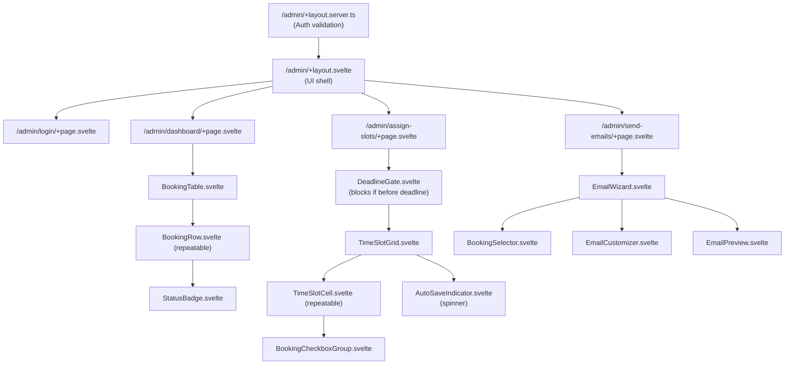

# SPEC-admin-booking-management

## Summary

Build an admin interface within the existing SvelteKit frontend to manage bookings after the route planning deadline. Admins can view booking completion status, assign final time slots using an interactive grid UI, customize confirmation text, and send confirmation emails to families. Authentication uses Strapi's Users & Permissions plugin with a custom "admin" role. The system uses HTTP-only cookies via SvelteKit server routes with `adapter-node`.

## Context

- The public booking flow allows families to select up to `max_time_slots` time preferences (overbooking)
- After the `route_planning_deadline`, admins need to assign one final time slot per booking
- Backend schema was extended in commits `6b82d05` and `06a3447`:
  - `booking-confirmation` is now a **separate collection type** (not component) for fine-grained permissions
  - Fields: `assigned_time_slot`, `assigned_time_slot_overwrite`, `additional_hint_type`, `additional_hint_text`, `additional_hint_rich`, `confirmation_sent`
  - Config fields added: `confirmation_email_subject_template`, `confirmation_email_body_template`
- Existing SvelteKit frontend (`frontend/`) provides reusable components, stores, and utilities
- Frontend currently uses `@sveltejs/adapter-static` which will be migrated to `@sveltejs/adapter-node` for server-side authentication
- **Architecture**: SvelteKit powers admin routes (`src/routes/admin/*`); in `frontend/`

## Goals (Acceptance criteria)

### Admin Authentication
- Admins log in via Strapi Users & Permissions with custom "admin" role
- Role has permissions: `booking` (find, findOne), `booking-confirmation` (find, findOne, create, update), `time-slot` (find, findOne), `config` (find), custom endpoint `sendConfirmationEmails`
- JWT stored in HTTP-only cookies via SvelteKit server route
- SvelteKit layout validates JWT and role on every request
- Client-side stores cache user data for UI reactivity

### Booking Dashboard
- Display all bookings in a sortable table with columns: Name, Email, Status, Assigned Slot, Confirmation Sent
- Status computed using existing `derivedStores.isRoutePlanningFilled` and `derivedStores.isEverythingFilled` logic
- Visual indicators: ✓ (green), ⚠ (yellow), ✗ (red)
- Search/filter capabilities by name, email, status
- Fetch all bookings with `populate=*` to get relations

### Time Slot Assignment UI
- **View-only mode before deadline**: Grid visible but editing disabled
- **Edit mode after `route_planning_deadline`**: Editing enabled (enforced client and server-side)
- **Warning system**: If `confirmation_sent = true`, warn admin before allowing ANY booking-confirmation field changes (`assigned_time_slot`, `assigned_time_slot_overwrite`, `additional_hint_text`). If admin confirms → reset `confirmation_sent = false`
- Grid layout showing all time slots (grouped by day); rows = timeslots by index; columns = days (on mobile there will only by a single column and the next day should be shown after all timeslots of the previous day)
- Each time slot "cell" lists bookings that selected it
- Checkboxes allow admin to assign one booking per slot (within one timeslot a maximum of `max_time_slots` bookings can be checked, if this number is reached all other checkboxes are disabled in this timeslot)
- Hovering over a checkbox of one booking will highlight all checkboxes of that booking in all other timeslots
- When a booking is assigned: it is grayed out in all other slots (but still selectable); if reassigned, the previous slot is freed
- **Auto-save**: Assignment changes saved within 2s with visual feedback (debounced updates)
- **Tab close warning**: Browser warns if unsaved changes exist
- **Loading indicator**: Spinner shows during save operations
- Visual feedback: assigned = `confirmation.assigned_time_slot !== null`
- **Deadline banner**: Countdown to `route_planning_deadline` shown at top of admin pages

### Confirmation Email Workflow
- Admin selects bookings individually or "select all visible" (respects current filter)
- **Selection counter**: "X selected (Y assigned / Z with slots / W total)"
  - X = number of selected bookings
  - Y = selected bookings with assigned_time_slot
  - Z = visible bookings with time_slots selected (any preferences)
  - W = grand total of all bookings (regardless of filter)
- **Already-sent warning**: Prevent selecting bookings with `confirmation_sent = true` (or show warning)
- Before sending, admin can customize **per booking**:
  - Overwrite time slot text (`assigned_time_slot_overwrite`)
  - Add additional text hints (`additional_hint_text`) - v1 uses plain text with newlines converted to `<br />` in HTML
- POST endpoint sends emails to selected bookings using existing email pipeline (ParameterReplacer + RichTextBlocksToHtmlRenderer)
- `confirmation_sent` flag set to `true` in `booking-confirmation` (NOT booking) after successful send
- UI shows which confirmations have been sent
- Email preview available before sending

### UI Constraints
- Desktop-only (≥1280px width), mobile/tablet on best effort using responsive design
- Reuse existing SvelteKit + Tailwind stack

## Non-goals

- Real-time collaboration (no WebSocket/live updates)
- Bulk CSV import/export of assignments
- Rich text editor for `additional_hint` in v1 (defer to v2; v1 uses plain text only)
- Advanced analytics or reporting dashboards
- Undo/redo functionality for assignments
- Optimistic locking for concurrent edits (v1 uses "last write wins")

## Decision

### Architecture

**Frontend**:
- Extend existing SvelteKit frontend with protected admin routes (`/admin/*`) using file-based routing
- Migrate from `@sveltejs/adapter-static` to `@sveltejs/adapter-node` for server-side authentication with HTTP-only cookies
- SvelteKit server routes handle authentication (`/admin/login/+page.server.ts`, `/admin/+layout.server.ts`)
- Client-side stores manage reactive UI state

**Backend**:
- Use existing Strapi 5 with custom "admin" role already created
- Add custom endpoint `POST /api/booking-confirmations/send-emails` for sending confirmation emails
- Add custom controller method `update` for booking-confirmation with server-side deadline enforcement
- Follow same pattern as existing `sendVerificationEmail` for email rendering

**Why This Approach**:
- **SvelteKit reuse**: Avoids separate admin app (React/Vue) which would add maintenance overhead
- **adapter-node**: Enables HTTP-only cookies (more secure than localStorage)
- **Separate collection type**: `booking-confirmation` as collection (not component) enables fine-grained permissions and better audit trail
- **Checkboxes over drag-drop**: User requested checkboxes for clarity; simpler to implement and test

### Email Template Placeholders

The confirmation email supports these placeholders (replace via ParameterReplacer):

**Simple Placeholders**:
- Contact: `{{first_name}}`, `{{last_name}}`, `{{email}}`, `{{phone_number}}`
- Address: `{{street}}`, `{{house_number}}`, `{{zip_code}}`, `{{place}}`, `{{present_location}}`
- Time: `{{assigned_time_slot}}` (formatted or overwritten), `{{assigned_time_slot_overwrite}}`
- Children: `{{children_count}}`, `{{children_names}}` (comma-separated), `{{children_list}}` (HTML `<ul>`)
- Hints: `{{additional_hint}}` (plain text → HTML with `<br />` for newlines)
- Status: `{{booking_status}}`, `{{missing_info_warning}}`, `{{route_planning_deadline}}`, `{{final_deadline}}`
- Actions: `{{booking_url}}`, `{{button('text')}}`

**Complex Placeholders** (pre-computed as HTML before ParameterReplacer):
- `{{booking_summary}}`: Complete HTML summary of all booking fields (contact, address, time, children, notes)
- `{{warnings_list}}` / `{{todo_list}}`: HTML list of missing information and action items based on completion status

**Warnings Logic** (for `{{warnings_list}}`):
- Missing contact details: "Kontaktdaten unvollständig"
- Missing address: "Adresse fehlt oder ist unvollständig"
- Missing children: "Keine Kinder angegeben"
- Incomplete child details: "Bitte ergänze noch fehlende Kinder-Details"
- Missing time slots: "Zeitslot-Präferenzen fehlen"
- Missing present_location: "Ort für Geschenke-Präsentation fehlt"

### Data Schemas

**booking-confirmation** (collection type):
```
{
  booking: Relation<oneToOne, Booking>,
  assigned_time_slot: Relation<oneToOne, TimeSlot>,
  assigned_time_slot_overwrite: string | null,
  additional_hint_type: Enum<'text' | 'rich'>,  // Default: 'text'
  additional_hint_text: string | null,
  additional_hint_rich: RichTextBlocks | null,
  confirmation_sent: boolean  // Default: false
}
```

**booking** (updated relation):
```
{
  confirmation: Relation<oneToOne, BookingConfirmation>  // MappedBy 'booking'
}
```

**config** (updated):
```
{
  confirmation_email_subject_template: string,  // Required
  confirmation_email_body_template: RichTextBlocks  // Required
}
```

### API Contracts

**Endpoint: `POST /api/booking-confirmations/send-emails`**

Request:
```json
{
  "bookingIds": ["id1", "id2"],
  "customizations": {
    "id1": {
      "assigned_time_slot_overwrite": "Freitag 5.12. um 19:30 Uhr",
      "additional_hint_text": "Bitte Glocke läuten"
    }
  }
}
```

Response:
```json
{
  "results": {
    "id1": { "success": true },
    "id2": { "success": false, "error": "No time slot assigned" }
  }
}
```

**Endpoint: `PUT /api/booking-confirmations/:id`**
- Validates `route_planning_deadline` before allowing updates
- Returns 403 if before deadline
- Otherwise, proceeds with standard update

**Existing Endpoints** (Strapi built-in):
- `POST /api/auth/local` - Login (returns JWT)
- `GET /api/users/me` - Get current user
- `GET /api/bookings?populate=*` - Fetch all bookings with relations
- `GET /api/time-slots` - Fetch all time slots
- `GET /api/config` - Fetch config

**SvelteKit Routes** (new):
- `POST /admin/login` - Login handler (sets HTTP-only cookie)
- `POST /admin/logout` - Logout handler (clears cookie)
- All `/admin/*` routes protected by `+layout.server.ts`

### SvelteKit Route Structure

```
frontend/src/routes/
  +layout.svelte                          - Public layout
  +page.svelte                            - Public booking form
  admin/
    +layout.svelte                        - Admin layout (client UI shell)
    +layout.server.ts                     - Admin auth guard (server-side)
    login/
      +page.svelte                        - Login form (client)
      +page.server.ts                     - Login handler (server sets cookie)
    dashboard/
      +page.svelte                        - Booking list/table
      +page.server.ts                     - Fetch bookings (server-side)
    assign-slots/
      +page.svelte                        - Time slot assignment grid
      +page.server.ts                     - Fetch bookings + time slots
    send-emails/
      +page.svelte                        - Confirmation email workflow
      +page.server.ts                     - Fetch bookings, handle send
```

### Component Hierarchy



### State Management

**New Stores**:
- `adminAuthStore`: Manages login, logout, user state, cookie persistence
- `adminBookingsStore`: Manages bookings data, assignments, confirmation-sent updates
- `derivedStores.canAdminAssignSlots`: Computed from `route_planning_deadline` (true if past deadline)

**Assignment Grid State**:
- Local Map: `bookingId → timeSlotId`
- Auto-save: Debounced 2s delay
- Unsaved changes: Browser `beforeunload` handler
- Loading tracking: Set of bookingIds currently saving

## Performance and Complexity

**Data Volume Expectations**:
- 50-200 bookings per season
- 20-50 time slots (5 days × 4-10 slots per day)
- Grid complexity: ~450 cells (150 bookings × 3 avg slots per booking)

**Performance Budgets**:
- **Initial Load**: <2s (bookings + time slots fetched server-side)
- **Grid Render**: <500ms (450-600 cells)
- **Assignment Update**: <300ms per booking (auto-saved)
- **Email Send**: <5s for batch of 50 bookings

**Complexity Targets**:
- Grid rendering: O(n) where n = total booking-slot pairs
- Search/filter: O(n) with 300ms debouncing
- State updates: O(1) for assignment changes

**Optimizations**:
- Server-side data fetching in `+page.server.ts`
- Debounced search (300ms) and auto-save (2s)
- Virtual scrolling if grid exceeds 1000 cells (unlikely but available)

## Compatibility and Platforms

**Browsers**:
- 97% of all currently used browsers
- Good layout for Desktop (≥1280px width); mobile possible with less layout capabilities

**Stack**:
- Backend: Strapi 5.x, Node.js v22 LTS
- Frontend: SvelteKit with `@sveltejs/adapter-node`, Node.js v22 LTS
- Email: Nodemailer → Mailhog (dev), configured SMTP (prod)

**Deployment**:
- Docker stack updated to use `adapter-node` build
- Environment variables: `PORT=3000`, `ORIGIN` (CSRF protection), `VITE_API_BASE_URL`

## Security, Privacy, and Compliance

**Threat Model**:
- **Unauthorized Access**: Mitigated by JWT in HTTP-only cookies + server-side role checks
- **CSRF**: Mitigated by SameSite cookie attribute + SvelteKit CSRF protection
- **XSS**: Mitigated by Svelte's automatic escaping; `additional_hint_text` is plain text → HTML with safe `<br />` replacement
- **Data Leakage**: Admin role access to all bookings is expected; role tightly controlled

**Security Measures**:
- JWT expiration: 7 days (configurable in Strapi)
- HTTP-only cookies (XSS-proof)
- SameSite=Strict cookie attribute
- HTTPS required in production
- Server-side deadline enforcement in controller
- Input sanitization: HTML entities escaped except `<br />` for newlines

**Privacy**:
- Admins see PII (names, emails, addresses) - expected for admin functions
- Email sending logs success/failure (consider storing in `booking-history` for audit trail)

**Compliance**:
- GDPR: Ensure admin users authorized to process PII
- Retention: Per organization policy (not specified in requirements)

## Test Plan

**Development Methodology**: Test-Driven Development (TDD)
- Red → Green → Refactor cycle for all components, stores, and services
- Post-implementation: verifier-profiler agent to achieve 90% branch coverage

**Test Infrastructure**:
- Backend: Vitest with mocked Strapi services
- Frontend: Vitest + Svelte Testing Library with mocked SvelteKit environment
- E2E: Playwright
- Coverage thresholds: 90% branches, 85% functions/lines/statements; but aim for 100% branch coverage

**Unit Test Coverage**:
- **Components**: BookingTable, TimeSlotGrid, BookingCheckboxGroup, EmailWizard, StatusBadge, DeadlineGate, AutoSaveIndicator, ConfirmDialog, BookingCounter
- **Stores**: adminAuthStore, adminBookingsStore, derivedStores.canAdminAssignSlots
- **Utilities**: assignment logic, debounce, beforeunload handler, showConfirmDialog

**Backend Test Coverage**:
- `sendConfirmationEmails`: all placeholders, error cases (missing slot, booking not found), partial failures
- Newline → `<br />` conversion
- Complex placeholder rendering (`{{booking_summary}}`, `{{warnings_list}}`)
- Permission tests (admin can/cannot, public cannot)
- Server-side deadline enforcement

**E2E Scenarios** (Playwright):
1. Admin login (valid/invalid credentials, HTTP-only cookie)
2. Booking dashboard (display, status badges, search, filter)
3. Time slot assignment (view-only before deadline, interactive after, confirmation-sent warning, auto-save, tab close warning, reassignment)
4. Confirmation emails (selection, counter, customization, preview, send, Mailhog verification)

**Edge Cases**:
- No bookings, all incomplete bookings
- Booking with no time slots
- Network error during auto-save
- Email send partial failure
- Concurrent admin updates (last write wins)
- Before route planning deadline
- Booking without assigned slot
- Email template missing

**Test Data**:
- Seed script: 3 admin users (admin, authenticated, public), 50 bookings (mix complete/incomplete), 20 time slots, some pre-assigned, some with `confirmation_sent = true`, config with email templates

## Rollout and Monitoring

**Deployment Phases**:
1. **Backend**: Write tests → implement service → add controller/route → configure permissions → verify coverage → test with Mailhog → deploy
2. **Frontend**: Write tests → migrate adapter → implement routes/components → add stores → integration tests → verify coverage → deploy to staging
3. **Staging Validation**: Automated tests (unit, E2E, performance), manual QA (all workflows, email rendering, deadline enforcement, counter, auto-save)
4. **Production**: Update Docker config, environment variables, monitor logs/latency, track coverage in CI/CD, train admins

**Migration Steps**:
- Manually add email templates in Strapi admin (Content Manager → Config)
- Test data migration (existing bookings without confirmation → `null` values acceptable)
- Optional feature flag: `ENABLE_ADMIN_UI` to hide routes until ready

**Monitoring**:
- **Metrics**: Admin login attempts, assignment updates, email send requests, API errors, auto-save performance
- **Logging**: Admin actions (login, assignments, emails), email delivery status, validation errors
- **Alerts**: Email send failure >10%, API response >2s (P95), auth failures >5/5min, auto-save failures >5%

**Rollback Plan**:
- Disable admin routes via feature flag or Nginx/Caddy
- Revert frontend deployment (Docker image)
- Backend changes backward-compatible
- Can revert to `adapter-static` if needed

## Risks and Mitigations

| Risk | Impact | Mitigation |
|------|--------|------------|
| Admin credentials compromised | High | HTTP-only cookies, JWT expiration, audit logs, HTTPS, strong password policy |
| Email send failures | Medium | Per-booking error reporting, retry mechanism, Mailhog testing, email queue monitoring |
| Grid UI performance | Medium | Performance budgets, auto-save debouncing, virtual scrolling if needed |
| Concurrent assignment conflicts | Low | Document "last write wins", add "Last edited" indicator in v2 |
| Deadline misconfiguration | Medium | Validate deadlines in Strapi admin, countdown in UI, server-side enforcement |
| `additional_hint_text` XSS | Medium | Plain text only, safe `<br />` replacement, no raw HTML |
| Auto-save data loss | Medium | 2s debounce (short), tab close warning, consider localStorage backup in v2 |
| Adapter migration issues | High | Test thoroughly in staging, rollback plan to `adapter-static` |
| Email template placeholders incorrect | Medium | Email preview before send, validate in tests, Mailhog verification |

## Open Questions

1. **Audit Trail for Assignment Changes** ✓ **RESOLVED**
   - Decision: YES, log in `booking-history`. Since `booking-confirmation` is collection type, Strapi auto-tracks `createdAt`, `updatedAt`, `createdBy`. Consider lifecycle hooks for history entries.

2. **Deadline Countdown Banner** ✓ **RESOLVED**
   - Decision: YES, include in v1 (DeadlineBanner.svelte in admin layout)

3. **Email Template Configuration Validation** ✓ **RESOLVED**
   - Decision: Fall back to defaults if templates empty. Show warning but don't block sending.

4. **"Select All Visible" Scope** ✓ **RESOLVED**
   - Decision: Select only visible bookings (respects filter). Counter: "X selected (Y assigned / Z with slots / W total)"

5. **Adapter Node Deployment Configuration** ✓ **RESOLVED**
   - Decision: Update Dockerfile to use `adapter-node` build, docker-compose.yml to expose port 3000, add `PORT` and `ORIGIN` env vars

6. **Confirmation-Sent Warning** ✓ **RESOLVED**
   - Decision: Warn before changing ANY booking-confirmation field if `confirmation_sent = true`. Show dialog, if proceed → reset to false.

7. **Data Migration for booking-confirmation** ⚠ **PENDING**
   - Question: Existing bookings with old confirmation component need migration?
   - Answer: Strapi schema migration should handle automatically. Test with existing DB.
   - Owner: Backend/DevOps Team
   - Due: Before staging deployment

## References

- [Backend Commit 6b82d05](../last_git_commit.patch) - Confirmation component and fields
- [Backend Commit 06a3447](../last_git_commit_switch.patch) - Switched to collection type
- [SvelteKit Adapter Node Docs](https://kit.svelte.dev/docs/adapter-node)
- [SvelteKit Hooks Docs](https://kit.svelte.dev/docs/hooks)
- [Svelte Migration Spec](04-SPEC-svelte-migration.md)
- [SummaryStep Component](../frontend/src/lib/components/steps/SummaryStep.svelte) - Status logic reference
- [Derived Stores](../frontend/src/lib/stores/derivedStores.svelte.ts)
- [Booking Service](../backend/src/api/booking/services/booking.ts) - `sendVerificationEmail` pattern
- [Strapi Users & Permissions Docs](https://docs.strapi.io/dev-docs/plugins/users-permissions)
- [Strapi Node Requirements](https://docs.strapi.io/dev-docs/installation/cli#preparing-the-installation)
- [CLAUDE.md](../CLAUDE.md) - Project conventions

## Implementation Phases

This feature is complex enough to benefit from phased implementation. Each phase is independently testable and deployable, delivering incremental value.

### Phase 1: Backend Foundation & Authentication

**Input**:
- Existing Strapi 5 backend with `booking-confirmation` schema
- Existing admin role and permissions
- Reference implementation: `sendVerificationEmail` pattern

**Output**:
- Custom endpoint `POST /api/booking-confirmations/send-emails` fully implemented
- Custom controller method `update` with server-side deadline enforcement
- Email rendering logic: all placeholders (simple + complex)
- Backend tests: 90% branch coverage for email service
- Permission tests: admin can/cannot, public cannot
- Documentation: API contract examples, test coverage report

**Dependencies**:
- Strapi 5 backend running
- Email config (Mailhog for dev, SMTP for prod)
- Config templates: `confirmation_email_subject_template`, `confirmation_email_body_template`

**Scope**: Medium
- ~3-5 days for TDD implementation
- Service method, controller, routes, tests
- Mailhog verification

**Success Criteria**:
- All E2E email tests pass (placeholders render correctly)
- Permission tests pass (admin only)
- Deadline enforcement tests pass (403 before deadline)
- Emails received in Mailhog with correct HTML/Markdown

---

### Phase 2: Frontend Infrastructure & Authentication

**Input**:
- Phase 1 backend (authentication endpoints)
- Existing SvelteKit frontend with `adapter-static`

**Output**:
- Migrated to `@sveltejs/adapter-node`
- Admin routes structure: `/admin/login`, `/admin/+layout.server.ts`
- `adminAuthStore`: login, logout, session management
- HTTP-only cookie authentication working
- Login page UI (simple form, error handling)
- Auth guard: redirect to login if not authenticated
- Docker configuration updated for `adapter-node`
- Frontend tests: auth store, login flow

**Dependencies**:
- Phase 1 backend (for `/api/auth/local`)
- Docker environment for testing

**Scope**: Medium
- ~3-5 days for TDD implementation
- Adapter migration, auth routes, stores, tests
- Docker build verification

**Success Criteria**:
- Admin can log in and JWT stored in HTTP-only cookie
- Unauthenticated users redirected to login
- Auth guard works on all `/admin/*` routes
- Tests pass: login success/failure, cookie persistence
- Docker build successful with `adapter-node`

---

### Phase 3: Dashboard & Time Slot Assignment Grid

**Input**:
- Phase 2 frontend (authenticated admin routes)
- Phase 1 backend (API endpoints)
- Existing stores: `derivedStores.isRoutePlanningFilled`, `derivedStores.isEverythingFilled`

**Output**:
- Booking dashboard: table, search, filter, status badges
- `adminBookingsStore`: fetch, update assignments
- Time slot assignment grid:
  - View-only before deadline, editable after
  - Checkboxes with max limit per slot
  - Hover highlighting across slots
  - Gray-out assigned bookings
  - Auto-save (2s debounce)
  - Tab close warning
  - Loading indicators
- `derivedStores.canAdminAssignSlots`
- DeadlineBanner component (countdown)
- Frontend tests: all components, stores, assignment logic
- E2E tests: dashboard, grid interaction, auto-save

**Dependencies**:
- Phase 2 (auth working)
- Phase 1 (API endpoints for assignments)

**Scope**: Large
- ~7-10 days for TDD implementation
- Multiple complex components
- Grid layout with responsive design
- Auto-save state management
- Comprehensive E2E scenarios

**Success Criteria**:
- Dashboard displays all bookings with correct status
- Search/filter works correctly
- Grid renders responsive (desktop + mobile)
- Checkboxes enforce max limit per slot
- Hover highlighting works
- Auto-save persists assignments within 2s
- Tab close warning appears on unsaved changes
- View-only mode before deadline enforced
- Tests pass: 90% branch coverage for grid components

---

### Phase 4: Confirmation Email Workflow & Polish

**Input**:
- Phase 3 frontend (dashboard + grid working)
- Phase 1 backend (email endpoint)
- Email preview functionality

**Output**:
- Email wizard UI: selection, customization, preview, send
- Selection counter: "X selected (Y assigned / Z with slots / W total)"
- Per-booking customization: `assigned_time_slot_overwrite`, `additional_hint_text`
- Email preview (rendered HTML with all placeholders)
- Confirmation-sent warning system (for all field changes)
- Send workflow: batch email, per-booking results
- UI polish: responsive design, error states, loading states
- E2E tests: email workflow, Mailhog verification
- Performance testing: 200 bookings load test

**Dependencies**:
- Phase 3 (grid and dashboard working)
- Phase 1 (email endpoint)
- Mailhog for testing

**Scope**: Medium
- ~4-6 days for TDD implementation
- Email wizard components
- Preview rendering
- Batch operations
- E2E scenarios

**Success Criteria**:
- Admin can select bookings (individual + "select all visible")
- Counter shows correct values
- Customization fields work per booking
- Email preview renders correctly with all placeholders
- Confirmation-sent warning appears for all field changes
- Emails sent successfully to Mailhog
- Per-booking results displayed (success/error)
- `confirmation_sent` flag updated correctly
- Tests pass: email workflow E2E scenarios
- Performance: <2s initial load with 200 bookings

---

### Phase Handoff Strategy

**Sequential Execution**:
1. Phase 1 → feature-implementer subagent (backend)
2. Phase 2 → feature-implementer subagent (frontend auth) after Phase 1 complete
3. Phase 3 → feature-implementer subagent (dashboard + grid) after Phase 2 complete
4. Phase 4 → feature-implementer subagent (email workflow) after Phase 3 complete

**Handoff Context**:
- Each phase includes: spec section, acceptance criteria, test requirements
- Prior phase outcomes: API contracts, component interfaces, test coverage reports
- If phase reveals new constraints: document in spec, adjust downstream phases

**Validation Between Phases**:
- Phase 1: Run backend tests, verify Mailhog emails
- Phase 2: Run auth E2E tests, verify Docker build
- Phase 3: Run grid E2E tests, verify performance budgets
- Phase 4: Run full E2E suite, verify staging deployment

**Risk Mitigation**:
- Each phase independently deployable (feature flags available)
- Phase failures don't block prior phase deployments
- Test coverage enforced at each phase boundary
